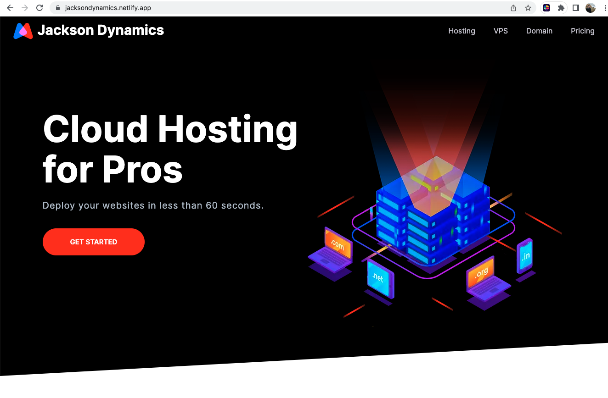

# HTML and CSS Cloud Hosting for customers Webpage

### A while ago, I decided to go through his HTML and CSS full course, which consisted of 3 parts, all totaling around 14 hours of material. The skills I have learned in that time have been absolutely critical for me as a developer!

### We started with the basics, but quickly moved into great techniques and tips and tricks to make my developer skills shine above the average programmer. I have since been referencing the guides from his course in all other projects I have been working on, and plan to continue moving forward.

### As the final project, we built a static example webpage as if we were a company selling Cloud Hosting for customers. From navigation bars, to main content, to testimonials, and footers. I also learned styling skills, such as animations, SVG files, importing new texts from the web, creating components that can be re-used as often as necessary.

### I am discovering a real passion for front-end web development I never really knew about till recently!

https://jacksondynamics.netlify.app/
